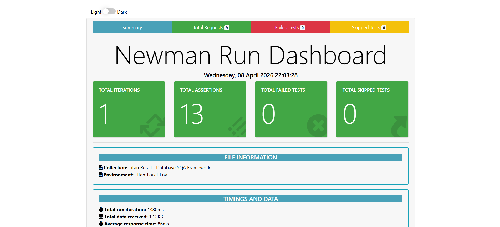

# 🛡️ Titan-DB-Automation-Framework
**Professional SQA Suite for Database Integrity & ACID Validation**


An industry-grade SQA framework designed to bridge the gap between **API Testing** and **Database Persistence**. This project utilizes a custom Python/Flask bridge to orchestrate automated validation of MySQL constraints, data lifecycle integrity, and transactional ACID properties.

---

## 🚀 Architecture & Workflow
The framework acts as an **Integration Layer** where Postman sends high-level instructions, the Python Bridge translates them into SQL, and the database executes them within a transactional scope.

---

## 📋 Test Plan & Methodology
This framework follows a structured **3-Tier Testing Lifecycle** to ensure 100% data reliability:

### 📁 Folder 1: Schema & Constraint Validation (The Guard)
* **Objective:** Verify that the database "Safety Rails" prevent data corruption.
* **Boundary Value Analysis (BVA):** Validated price constraints (`CHECK` rules) via **MySQL Error 3819**.
* **Null Validation:** Enforcing mandatory fields to prevent incomplete record injection (**Error 1364**).
* **Identity Integrity:** Testing `UNIQUE` key constraints to prevent duplicate entries (**Error 1062**).

### 📁 Folder 2: Data Integrity (The Lifecycle)
* **Objective:** Verify CRUD operations maintain data state without "bleeding."
* **Write-Read Consistency:** Ensuring precision of `DECIMAL(10,2)` types.
* **Side-Effect Analysis:** Verifying that updates to a single column do not corrupt neighboring data.
* **Referential Integrity:** Validating `ON DELETE CASCADE` rules between Orders and Products.

### 📁 Folder 3: ACID Property Testing (The Core)
* **Objective:** Verify "All or Nothing" transactional logic.
* **Atomicity:** Simulated logic failures to verify that the Python bridge triggers a full `ROLLBACK`.
* **Concurrency:** Validating stock locking mechanisms to prevent "Overselling" bugs in high-traffic environments.

---

## 📊 Automated Reporting
The framework generates a high-fidelity **HTML Report** via Newman. It breaks down success rates by folder, allowing SQA engineers to pinpoint exactly where a schema constraint or a transaction failed.

### Dashboard Overview


*The framework achieved a **100% Pass Rate** across 9 requests and 13 assertions.*

---

## 🛠️ Tech Stack
| Component | Technology |
| :--- | :--- |
| **Automation Engine** | Python (Flask / `mysql-connector`) |
| **Data Persistence** | MySQL (InnoDB Engine) |
| **Test Orchestration** | Postman + Newman CLI |
| **Reporting** | Newman HTMLExtra |

---

## ⚙️ Setup & Execution

1.  **Initialize Database:**
    ```sql
    SOURCE database/schema.sql;
    ```
2.  **Install Dependencies:**
    ```bash
    pip install -r requirements.txt
    ```
3.  **Launch the Bridge:**
    ```bash
    python bridge.py
    ```
4.  **Execute Suite & Generate Report:**
    ```bash
    newman run Titan_Retail_SQA.json -e Local_Env.json -r htmlextra --reporter-htmlextra-export report.html
    ```

---

## 🛡️ Documented Bug Findings
During the SQA lifecycle, the following vulnerabilities were identified and resolved:
* **ID-001 (Identity):** Lack of `UNIQUE` constraint allowed duplicate entries for product names.
* **ID-002 (Integrity):** Foreign Key violations identified during partial transaction failures, resolved by implementing Python-side Rollback logic.

---
**Developed by Faizan Ahmed Khan**
